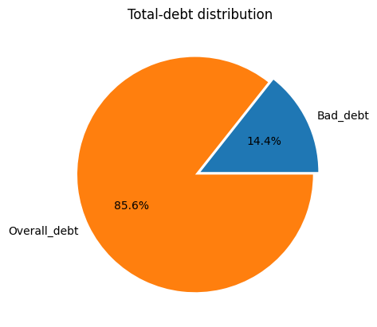
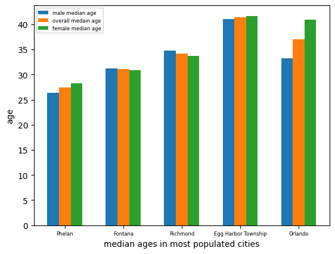

# 🏡 Real Estate Exploratory Data Analysis (EDA)

## 📌 Project Overview  
This project focuses on **exploratory data analysis (EDA) of real estate data** to uncover insights into property pricing, trends, and relationships among various features. The analysis involves **data cleaning, transformation, visualization, and statistical analysis** to derive meaningful conclusions that can assist in real estate decision-making and market understanding.  

---

## 🎯 Objectives  
- Perform **data cleaning and preprocessing** to prepare raw real estate data for analysis.  
- Conduct **exploratory analysis** to identify patterns, trends, and outliers.  
- Apply **statistical and visual techniques** to understand the impact of different features on property prices.  
- Provide **data-driven insights** for potential buyers, sellers, and analysts.  

---

## 🛠️ Skills & Tools Demonstrated  

### 🔹 Data Handling & Preprocessing
- Managed **missing values, duplicates, and outliers** for a clean dataset.  
- Converted categorical and numerical variables into analysis-friendly formats.  
- Applied **feature engineering** where necessary.  

### 🔹 Exploratory Data Analysis (EDA)
- Used **pandas** & **NumPy** for descriptive statistics and dataset manipulation.  
- Conducted **correlation analysis** to identify relationships between features.  
- Derived actionable insights through grouping, aggregation, and trend analysis.  

### 🔹 Data Visualization
- Leveraged **Matplotlib** & **Seaborn** for high-quality, insightful visualizations.  
- Created **histograms, boxplots, heatmaps, scatter plots**, and distribution plots.  
- Designed clear visual narratives to highlight patterns and anomalies in the housing market.  

### 🔹 Analytical & Problem-Solving Skills
- Translated raw datasets into meaningful insights for decision-making.  
- Evaluated how variables like **location, area, and amenities** influence property prices.  
- Built a strong **data storytelling approach** through visualizations and structured findings.  

### 🔹 Software & Tools
- **Python**
- pandas
- NumPy
- Matplotlib
- Seaborn
- **Jupyter Notebook** for interactive development and documentation

---

## 📊 Key Insights (Example Highlights)
- Property prices are strongly influenced by **location and property size**.  
- Certain neighborhoods show **outlier pricing trends**, potentially indicating premium markets.  
- Feature correlation analysis revealed **high dependency of price on square footage** compared to other amenities.  

---

## Some Visualization Examples






## 🚀 How to Run the Project
1. Clone this repository:  
   ```bash
   git clone https://github.com/your-username/Real_estate_EDA.git
   cd Real_estate_EDA
   ```

2. Open the Jupyter Notebook:

    ```bash
    jupyter notebook Real_estate_EDA.ipynb 
    ```
